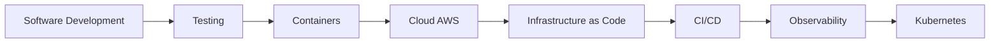

<div align="center">


<br/>

[](https://github.com/M4rc3low)
[](https://m4rc3low.github.io)
[](https://www.linkedin.com/in/marcelo-s-gomes/)
[](https://github.com/M4rc3low)

</div>

## 👨‍💻 Sobre mim

Sou desenvolvedor em evolução contínua, construindo projetos que conectam **desenvolvimento de software, problemas reais de negócio, cloud e DevOps**.

Meu foco atual está em aplicações web modernas, organização e visualização de dados, infraestrutura na AWS, containers, observabilidade e Infrastructure as Code.

```text
$ whoami
Marcelo Gomes

$ focus
Software Development • Cloud • DevOps

$ currently-learning
AWS • Docker • Kubernetes • Terraform • CI/CD • Observability

$ approach
Build → Test → Deploy → Observe → Improve
```

## 🧰 Stack & ferramentas

<div align="center">

[](https://skillicons.dev)

<br/>


</div>

## 📊 Painel do GitHub

<div align="center">


</div>

## 🚀 Projetos em destaque

| Projeto | O que demonstra | Tecnologias / foco |
| --- | --- | --- |
| [⚖️ **PeritoLex**](https://github.com/M4rc3low/peritolex-app) | Organização de processos, prazos e alertas com pipeline automatizada de qualidade | React, Vite, Tailwind, Docker, GitHub Actions |
| [🗺️ **GeoTerritórios**](https://github.com/M4rc3low/geoterritorios-marcelo-app) | Organização territorial, mapas e indicadores com validação automatizada | React, Leaflet, Docker, GitHub Actions |
| [📋 **Pioneiro Pro**](https://github.com/M4rc3low/pioneiro-pro-app) | Organização operacional, acompanhamento de dados e produtividade | React, TanStack Query, Recharts, Docker, CI |
| [🏗️ **AMM Materiais de Construção**](https://github.com/M4rc3low/amm-materiais-construcao) | Tecnologia aplicada a um negócio real, presença digital e ferramentas práticas | HTML, CSS, JavaScript, Docker, GitHub Actions |
| [☁️ **AWS Monitoring Lab**](https://github.com/M4rc3low/aws-monitoring-lab) | Observabilidade e monitoramento de infraestrutura | Docker Compose, PostgreSQL, Zabbix, Grafana, AWS |
| [🏗️ **Terraform AWS Lab**](https://github.com/M4rc3low/terraform-aws-lab) | Infraestrutura reproduzível e versionada em nuvem | Terraform, AWS, Infrastructure as Code |

## 🧪 Engenharia aplicada nos projetos

Nos repositórios principais, procuro documentar e validar não apenas a interface, mas também o processo de engenharia:

- **Smoke tests** para detectar regressões estruturais simples
- **ESLint e typecheck** para qualidade estática
- **Build automatizado** para validar a aplicação
- **Docker** para execução reproduzível
- **GitHub Actions** para CI em pushes e pull requests
- **Documentação de segurança** para evitar exposição de credenciais e dados reais

## ☁️ Cloud & DevOps lab

O GitHub também funciona como meu laboratório técnico. Aqui estou construindo e documentando experiências práticas com:

- **AWS** — infraestrutura e serviços em nuvem
- **Terraform** — Infrastructure as Code
- **Docker** — empacotamento e execução de aplicações
- **Kubernetes** — orquestração de containers
- **GitHub Actions** — automação e CI/CD
- **Zabbix + Grafana** — monitoramento e observabilidade
- **Linux + Git** — base operacional e versionamento

## 🎯 Em evolução



> Meu objetivo não é apenas acumular tecnologias, mas entender como aplicações são **construídas, testadas, entregues, executadas, monitoradas e evoluídas** em ambientes reais.

---

<div align="center">

### ⚡ Build. Test. Deploy. Observe. Improve.

`React` • `AWS` • `Docker` • `Terraform` • `Kubernetes` • `GitHub Actions`

</div>
