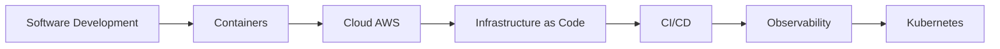

<div align="center">


<br/>

[](https://github.com/M4rc3low)
[](https://m4rc3low.github.io)
[](https://github.com/M4rc3low)

</div>

## 👨‍💻 Sobre mim

Sou desenvolvedor em evolução contínua, construindo projetos que conectam **desenvolvimento de software, problemas reais de negócio, cloud e DevOps**.

Meu foco atual está em aplicações web modernas, organização e visualização de dados, infraestrutura na AWS, containers, observabilidade e Infrastructure as Code.

```text
$ whoami
Marcelo Gomes

$ focus
Software Development • Cloud • DevOps

$ currently-learning
AWS • Docker • Kubernetes • Terraform • CI/CD • Observability

$ approach
Build → Measure → Automate → Improve
```

## 🧰 Stack & ferramentas

<div align="center">

[](https://skillicons.dev)

<br/>


</div>

## 📊 GitHub dashboard

<div align="center">


<br/>


<br/>


</div>

## 🚀 Projetos em destaque

<div align="center">

<a href="https://github.com/M4rc3low/peritolex-app">
  
</a>
<a href="https://github.com/M4rc3low/geoterritorios-marcelo-app">
  
</a>

<a href="https://github.com/M4rc3low/amm-materiais-construcao">
  
</a>
<a href="https://github.com/M4rc3low/aws-monitoring-lab">
  
</a>

</div>

### ⚖️ PeritoLex
Aplicação web orientada a produtividade para organização de **processos, prazos, documentos, movimentações e alertas**, construída com React e uma arquitetura preparada para evoluir para backend e integrações externas.

### 🗺️ GeoTerritórios
Aplicação para organização e visualização de **territórios, endereços, indicadores e cobertura geográfica**, usando React, Leaflet, TanStack Query e Recharts.

### 🏗️ AMM Materiais de Construção
Projeto aplicado a um **negócio real**, criado para fortalecer presença digital, catálogo, atendimento e experiência do cliente com React, Vite e Tailwind CSS.

### ☁️ AWS Monitoring Lab
Laboratório de **observabilidade e infraestrutura**, combinando Docker Compose, PostgreSQL, Zabbix, Grafana e preparação para monitoramento de instâncias AWS.

## ☁️ Cloud & DevOps lab

O GitHub também funciona como meu laboratório técnico. Aqui estou construindo e documentando experiências práticas com:

- **AWS** — infraestrutura e serviços em nuvem
- **Terraform** — Infrastructure as Code
- **Docker** — empacotamento e execução de aplicações
- **Kubernetes** — orquestração de containers
- **GitHub Actions** — automação e CI/CD
- **Zabbix + Grafana** — monitoramento e observabilidade
- **Linux + Git** — base operacional e versionamento

<div align="center">

<a href="https://github.com/M4rc3low/terraform-aws-lab">
  
</a>
<a href="https://github.com/M4rc3low/aws-monitoring-lab">
  
</a>

</div>

## 🎯 Em evolução



> Meu objetivo não é apenas acumular tecnologias, mas entender como aplicações são **construídas, entregues, executadas, monitoradas e evoluídas** em ambientes reais.

---

<div align="center">

### ⚡ Build. Deploy. Observe. Improve.

`React` • `AWS` • `Docker` • `Terraform` • `Kubernetes` • `GitHub Actions`

<br/>


</div>
